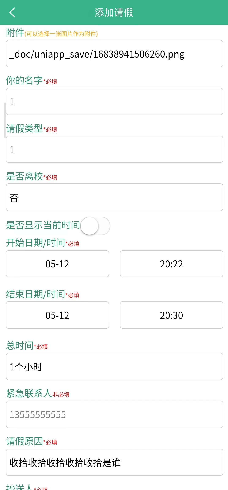
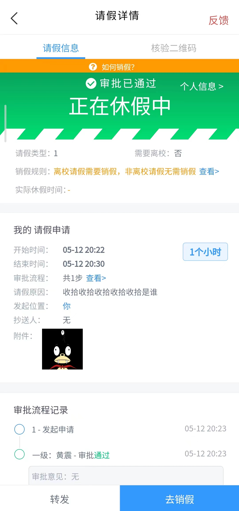
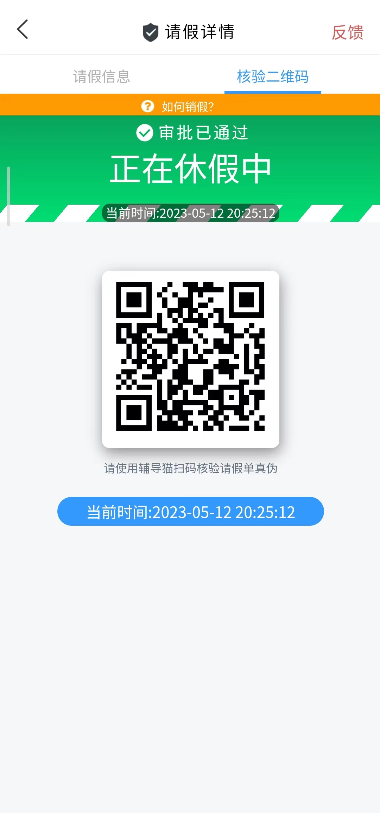

# **campus-today**

##### 今日校园模拟请假软件(带核验码)

---

##  **使用须知**

##### 本软件使用[Uni-App](https://uniapp.dcloud.io/)编写

基于https://github.com/ZeroMean/leave-school 进行的二次开发

##### 软件仅供学习研究使用，请勿用于任何商业非法用途，否则造成任何后果作者概不负责！！！

请大家严格遵守学校和国家的相关规定，软件仅供学习研究使用，请勿用于商业及非法用途。

## **安装包在网页右侧发行版中** 

##  优化更新

2023/5/12
将页面UI更新为新的今日校园版本，修复原本请假时间小时数为个数时不显示前置0 的bug

##  平台使用

支持安卓/IOS。

## 软件截图

